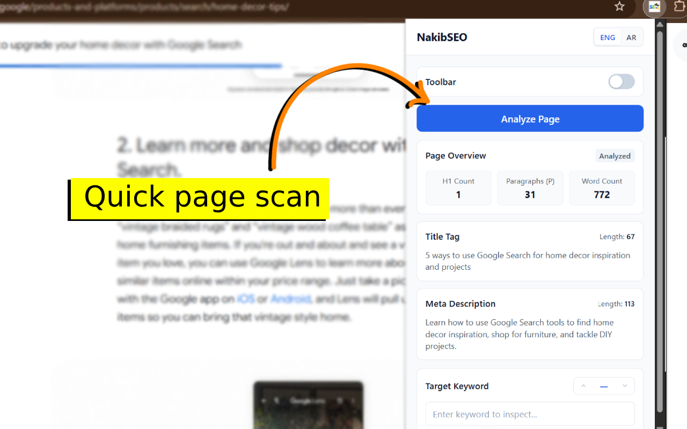
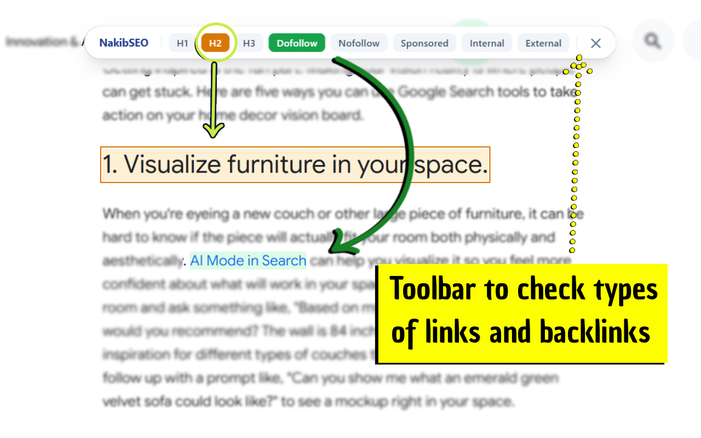
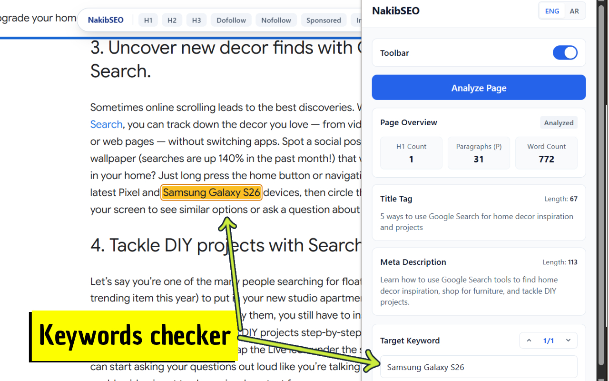

# NakibSEO

**On-page SEO inspection and analysis for Chrome**

NakibSEO is a lightweight Chrome extension designed to help you quickly inspect important on-page SEO elements directly from the webpage you are viewing.

It provides a simple way to review page structure, content, links, keywords, and other basic SEO signals without leaving the current page.

> **Note:** This repository does not contain the source code of NakibSEO. It serves as a public information page and release archive for the extension.

## Screenshots

### Extension popup

### In-page SEO toolbar

### Keyword highlighting

## Features

### On-page SEO inspection

Inspect important SEO-related elements directly on the current page, including:

* Page title
* Meta description
* Heading structure
* H1 elements
* Page text and basic content information
* Links and other on-page elements
* Basic on-page SEO signals

### Keyword tools

Enter a keyword to find and highlight matching occurrences directly on the current page.

You can:

* Highlight keyword occurrences
* Navigate between matches
* Quickly inspect where a keyword appears on the page

### In-page SEO toolbar

NakibSEO includes an optional in-page toolbar that allows you to visually inspect relevant elements directly on the page.

The toolbar provides quick access to useful inspection and highlighting features without requiring you to leave the page.

### Privacy-focused

NakibSEO performs its page inspection locally in your browser.

The extension does not require a remote SEO analysis service to process the page.

NakibSEO requests only the permissions required for its current functionality and does not require broad host permissions.

For more information, see the [Privacy Policy](https://www.webcava.com/p/nakibseo-privacy.html).

### Simple and focused

NakibSEO is designed for quick on-page inspection rather than automated site-wide crawling or off-page SEO analysis.

It works directly with the page currently being inspected and provides a focused interface for reviewing SEO-related page structure and content.

## Languages

NakibSEO is available in:

* English
* Arabic

## Chrome Web Store

Get NakibSEO from the Chrome Web Store:

**[Install NakibSEO](https://chromewebstore.google.com/detail/nakibseo/obnjjeoighjipilokheneakbdcfbjmfk)**

## Privacy Policy

The NakibSEO privacy policy is available here:

**[Privacy Policy](https://www.webcava.com/p/nakibseo-privacy.html)**

## Updates & Releases

This repository is maintained as a public archive for NakibSEO.

When a new version of the extension is released, the corresponding release information and changelog may be updated here.

See [CHANGELOG.md](CHANGELOG.md) for the history of updates.

## Repository Purpose

This repository is intended to provide:

* Information about NakibSEO
* Feature documentation
* Release history
* Update notes
* Links to the Chrome Web Store
* Links to the privacy policy

The source code of NakibSEO is not publicly available in this repository.

## About

NakibSEO is developed by **WebCava**.

For more information, visit:

**[WebCava](https://www.webcava.com/)**
